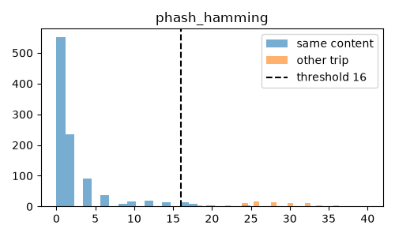
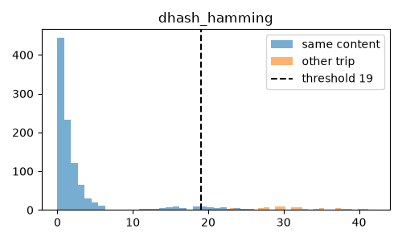
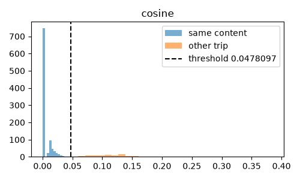
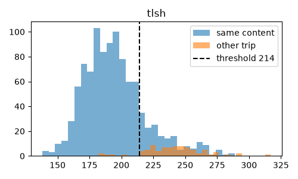
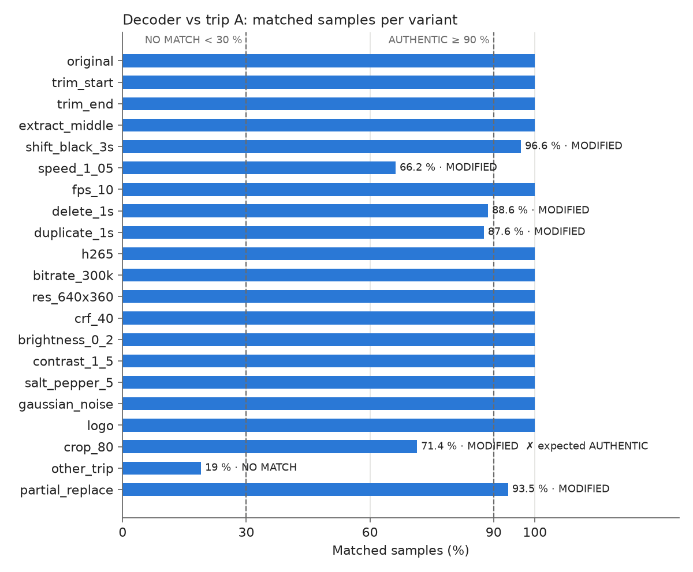

# Decoder report — Dashcam Video Integrity

The decoder verifies a video against the hashes the encoder stored in Supabase. It answers: does it
match, which trip, where in the trip, what percentage matches, which sections were modified, is it a
bit-exact original segment, and how long the check took.

## 1. Install and run

Requirements: Python ≥ 3.11, and `ffmpeg` only for the evaluation scripts.

**macOS / Linux**
```bash
python3 -m venv .venv
source .venv/bin/activate
pip install -r requirements.txt
cp decoder/.env.example decoder/.env      # SUPABASE_URL and SUPABASE_ANON_KEY
uvicorn decoder.main:app --reload         # open http://localhost:8000
python -m pytest                          # tests
```

**Windows (PowerShell)**
```powershell
python -m venv .venv
.venv\Scripts\activate
pip install -r requirements.txt
copy decoder\.env.example decoder\.env    # edit it with Notepad
uvicorn decoder.main:app --reload
python -m pytest
```

**Using it:** choose a trip (or "Auto — search all trips"), choose a video, press Verify. The page
shows the verdict, the result table and a bar with one box per 0.5 s (green = matched, red =
changed, grey = no stored sample at that time). "Purge" deletes server data older than N hours.

API: `POST /api/verify` (form: `video`, optional `trip_id`), `GET /api/trips`, `POST /api/purge`.

**Evaluation** (needs `ffmpeg`; `brew install ffmpeg` / `winget install ffmpeg`):
```bash
python eval/make_variants.py eval/data/tripA.mp4 eval/data/tripB.mp4
python -m eval.metric_study        # metric comparison, writes decoder/thresholds.json
python -m eval.video_eval <tripA id>
```

## 2. How it works (and why)

1. **Exact check:** SHA-256 of the uploaded file is looked up in `segments`. A hit means the file is
   byte-for-byte a recorded segment ("bit-exact original segment N"). Any change breaks it.
2. **Sampling:** the video is read frame by frame with OpenCV and one pHash is taken every 500 ms of
   video time (same rate as the encoder). Frames are read sequentially, not by seeking, because
   browser WebM files have no index.
3. **Sliding window:** candidate offsets put the first video sample on every stored sample (video starts
   inside the trip) and the first stored sample on every video sample (extra content before the trip).
   For each offset, each video sample is compared with the stored sample **closest in time** (`t_ms`,
   up to 600 ms away). The offset with the lowest mean Hamming distance is the **position in the trip**.
   Missing samples count as 32 bits, the distance between unrelated hashes.
4. **Per sample:** matched if distance ≤ threshold (16 bits, from the evaluation below).
   **Two or more** unmatched samples in a row = a **modified section** (from–to seconds).
5. **Verdict:** `AUTHENTIC` (≥ 90 % matched and no modified section), `MODIFIED` (30–90 % or any
   modified section), `NO MATCH` (< 30 %).
6. Without a trip ID the video is compared with every trip and the best one wins. A bit-exact
   SHA-256 match always selects its own trip.

Why pHash in the decoder although cosine scored slightly higher (below): a pHash is 64 bits
(16 hex chars) per sample and is compared with a fast Hamming distance. The cosine metric needs a
256-value vector per sample. pHash is also the same algorithm in the browser and in Python (verified
by a test). Its accuracy is almost identical (98.9 % vs 99.8 %) with **0 false positives**.

## 3. Results

Data: trip A = `tripA.mp4` (84 s dashcam video, recorded with the encoder in file mode, trip
`a2280b49`), trip B = `tripB.mp4` (10.4 s, trip `e2b53bdc`). Variants were made from a 720p copy of
trip A (4K processing was too slow; the hashes work on 32×32 images).

### 3.1 Metric comparison (`eval/results/thresholds.csv`)
1008 positive pairs (frame of A vs the same timestamp in a content-preserving variant, 1 per second,
12 variants) and 84 negative pairs (frame of A vs frame of B). Threshold = best balanced accuracy.

| Metric | Threshold | Accuracy | True pos. rate | False pos. rate | Mean same content | Mean other trip |
|---|---|---|---|---|---|---|
| cosine (16×16 gray) | 0.048 | 0.998 | 0.996 | 0.000 | 0.005 | 0.117 |
| **pHash Hamming** | **16** | **0.989** | **0.978** | **0.000** | **2.38** | **28.19** |
| pHash normalized | 0.250 | 0.989 | 0.978 | 0.000 | 0.037 | 0.440 |
| wHash Hamming | 10 | 0.989 | 0.990 | 0.012 | 1.09 | 20.45 |
| wHash normalized | 0.156 | 0.989 | 0.990 | 0.012 | 0.017 | 0.320 |
| dHash Hamming | 19 | 0.985 | 0.969 | 0.000 | 2.48 | 30.69 |
| dHash normalized | 0.297 | 0.985 | 0.969 | 0.000 | 0.039 | 0.480 |
| aHash Hamming | 7 | 0.979 | 0.982 | 0.024 | 0.92 | 12.87 |
| aHash normalized | 0.109 | 0.979 | 0.982 | 0.024 | 0.014 | 0.201 |
| L1 (16×16 gray) | 0.120 | 0.958 | 0.917 | 0.000 | 0.034 | 0.195 |
| L2 (16×16 gray) | 2.64 | 0.957 | 0.915 | 0.000 | 0.668 | 3.959 |
| TLSH (JPEG bytes) | 214 | 0.885 | 0.829 | 0.060 | 194.9 | 240.8 |
| ssdeep (JPEG bytes) | — | 0.500 | — | — | 100 | 100 |

Normalized Hamming = Hamming / 64, so it gives the same ranking. **ssdeep and TLSH do not work** on
video frames: they hash the compressed bytes, and any re-encoding changes all the bytes (ssdeep
similarity was 0 for every pair). All histograms: `eval/results/hist_*.png`.

 
 

*Figure 1 — Distance histograms: same content (blue) vs other trip (orange), dashed line = chosen
threshold. pHash, dHash and cosine separate the two groups; TLSH overlaps.*

Mean Hamming distance (bits) per variant (`eval/results/mean_distance_per_variant.csv`):

| Variant | pHash | dHash | aHash | wHash |
|---|---|---|---|---|
| original (re-encoded) | 0.12 | 0.12 | 0.06 | 0.05 |
| H.265 | 0.10 | 0.37 | 0.05 | 0.17 |
| 640×360 | 0.17 | 0.37 | 0.05 | 0.12 |
| Gaussian noise | 0.31 | 0.38 | 0.11 | 0.17 |
| salt & pepper 5 % | 0.38 | 0.90 | 0.19 | 0.29 |
| CRF 40 | 0.79 | 1.48 | 0.23 | 0.45 |
| 300 kbit/s | 0.81 | 1.80 | 0.27 | 0.57 |
| 10 fps | 1.36 | 0.88 | 0.23 | 0.52 |
| brightness +0.2 | 2.71 | 1.23 | 1.58 | 0.64 |
| contrast ×1.5 | 2.98 | 3.24 | 1.18 | 1.88 |
| logo overlay | 4.05 | 0.68 | 0.74 | 0.26 |
| crop 80 % | 14.76 | 18.30 | 6.36 | 8.00 |
| **trip A vs trip B** | **28.19** | **30.69** | **12.87** | **20.45** |

### 3.2 Decoder on whole videos (`eval/results/video_eval.md`)
The real decoder (hashes of the variants in Python vs the hashes the **browser** stored for trip A),
pHash threshold 16 bits.

| Variant | Expected | Verdict | Matched % | Mean dist. | Position (s) | Modified sections | Time (ms) |
|---|---|---|---|---|---|---|---|
| original | AUTHENTIC | AUTHENTIC | 100 | 1.25 | 0.1 | – | 3261 |
| trim start (−10 s) | AUTHENTIC | AUTHENTIC | 100 | 1.23 | 10.1 | – | 2955 |
| trim end (−10 s) | AUTHENTIC | AUTHENTIC | 100 | 1.24 | 0.1 | – | 3225 |
| extract middle (20 s) | AUTHENTIC | AUTHENTIC | 100 | 1.10 | 32.1 | – | 833 |
| shift (3 s black at start) | MODIFIED | MODIFIED | 96.6 | 2.36 | −2.9 | 0.0–3.0 s | 3646 |
| speed ×1.05 | MODIFIED | MODIFIED | 66.2 | 13.28 | 3.1 | 10 sections | 3332 |
| 10 fps | AUTHENTIC | AUTHENTIC | 100 | 1.32 | 0.1 | – | 2364 |
| delete 1 s | MODIFIED | MODIFIED | 88.6 | 6.39 | 1.1 | 4.0–11.0; 14.0–15.0; 40.5–41.5 s | 3528 |
| duplicate 1 s | MODIFIED | MODIFIED | 87.6 | 6.45 | −0.9 | 5.0–12.0; 13.0–14.0; 41.5–43.0 s | 3515 |
| H.265 | AUTHENTIC | AUTHENTIC | 100 | 1.38 | 0.1 | – | 3382 |
| 300 kbit/s | AUTHENTIC | AUTHENTIC | 100 | 1.61 | 0.1 | – | 2784 |
| 640×360 | AUTHENTIC | AUTHENTIC | 100 | 1.31 | 0.1 | – | 901 |
| CRF 40 | AUTHENTIC | AUTHENTIC | 100 | 1.56 | 0.1 | – | 2765 |
| brightness +0.2 | AUTHENTIC | AUTHENTIC | 100 | 3.08 | 0.1 | – | 3462 |
| contrast ×1.5 | AUTHENTIC | AUTHENTIC | 100 | 3.57 | 0.1 | – | 3587 |
| salt & pepper 5 % | AUTHENTIC | AUTHENTIC | 100 | 1.36 | 0.1 | – | 7604 |
| Gaussian noise | AUTHENTIC | AUTHENTIC | 100 | 1.39 | 0.1 | – | 6856 |
| logo overlay | AUTHENTIC | AUTHENTIC | 100 | 4.13 | 0.1 | – | 3539 |
| crop 80 % | AUTHENTIC | **MODIFIED** ✗ | 71.4 | 14.69 | 0.1 | 11 sections | 1924 |
| other trip (B) | NO MATCH | NO MATCH | 19.0 | 23.52 | 7.6 | – | 500 |
| partial replacement (5 s of B) | MODIFIED | MODIFIED | 93.5 | 3.58 | 0.1 | 42.0–47.5 s | 3368 |



*Figure 2 — Matched samples per variant (pHash threshold 16 bits). Dashed lines: verdict limits.*

**Summary:** 21 variants, **20 correct verdicts**. True matches 20, **missed matches 0**,
**false matches 0**, modifications detected **5 / 5**. Processing time 0.5–7.6 s per variant (10–87 s of
720p video, laptop CPU). Position checks: trimming 10 s gives 10.1 s; the middle extract (cut at
32.0 s) gives 32.1 s; the 3 s black intro gives −2.9 s. The replaced 5 s (42.0–47.0 s) are reported
as 42.0–47.5 s.

**Real browser segment** (manual check): a WebM segment downloaded from the encoder
(`trip-72d0f447-seg0.webm`) → exact SHA-256 match with segment 0, `AUTHENTIC`, position 0.0 s,
mean distance 3.0 bits. The JS and Python hashes of the same frames differ by 0–2 bits on most samples.

## 4. Limitations

- **Crop** changes the whole frame for a global hash → crop 80 % is not recognised as authentic
  (14.8 bits mean pHash distance, close to the 16-bit threshold). This is the only wrong verdict.
- **Only one offset per video:** after a cut or a duplicated second, one half of the video is
  aligned and the other is 1 s off. The video is correctly flagged `MODIFIED`, but some of the reported
  sections are in fast-moving parts of the misaligned half, not exactly at the edit (e.g. delete 1 s at
  42 s → sections 4–11 s and 40.5–41.5 s). The same happens with **speed changes**.
- **Visually similar trips** (e.g. two webcam recordings of the same desk) look the same to perceptual
  hashes; the decoder may confuse them. Real dashcam trips differ a lot (28 bits apart on average).
- "Other trip" got 19 % matched samples, under the 30 % NO MATCH limit but not by much (B is only 10 s).
- Big logos or overlays covering a large part of the frame will raise the distance (a small logo
  gave 4.1 bits).
- Thresholds come from one pair of videos; more varied footage (night, rain) would give more reliable values.
- No authentication on the API (prototype).
