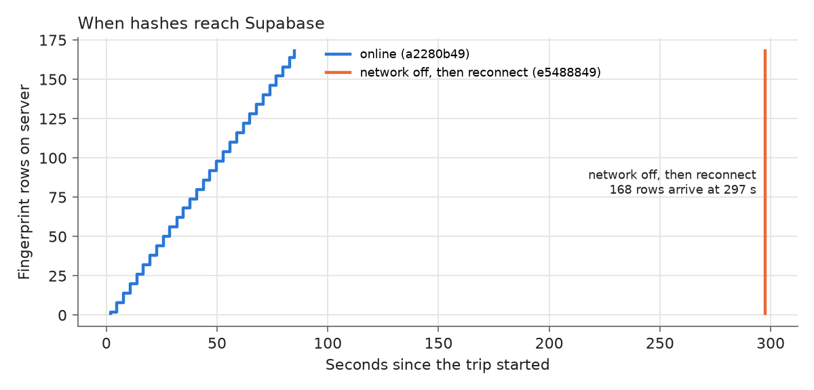

# Encoder report — Dashcam Video Integrity

The encoder is a web page that records dashcam video from the laptop webcam (or a video file),
cuts it into 10-second segments, computes a SHA-256 hash for every segment and perceptual hashes
(pHash + dHash) twice per second, and sends the hashes live to Supabase. It keeps working without a
network: everything is queued in the browser and uploaded later without losses or duplicates.

## 1. Install and run

Requirements: [Node.js LTS](https://nodejs.org), Google Chrome, a Supabase project.

**Supabase (once):** open the project → SQL Editor → paste all of `supabase/schema.sql` → Run.
Then Settings → API: copy the Project URL and the publishable (anon) key.

**macOS / Linux**
```bash
cd encoder
npm install
cp .env.example .env        # put VITE_SUPABASE_URL and VITE_SUPABASE_ANON_KEY in it
npm run dev                 # open http://localhost:5173 in Chrome
npm test                    # unit tests
SUPABASE_IT=1 npm test      # + integration tests against Supabase
```

**Windows (PowerShell)**
```powershell
cd encoder
npm install
copy .env.example .env      # edit it with Notepad
npm run dev                 # open http://localhost:5173 in Chrome
npm test
$env:SUPABASE_IT=1; npm test
```

`localhost` is a secure context, so the camera works without HTTPS.

**Using it:** type a Driver ID → choose Webcam or Video file → Start. The Status table shows frames,
hashes, rows sent, pending rows, network state and upload latency. "Simulate offline" stops the
uploads. Recorded segments are listed at the bottom with a Download link (used to test the decoder).
Keep the tab visible while recording (see limitations).

## 2. How it works (and why)

```
webcam / video file
  │
  ▼
<canvas> 640x360, 15 fps ─► captureStream ─► MediaRecorder (restarted every 10 s)
  │                                            └─► segment .webm ─► SHA-256 ──┐
  └─► every 500 ms: getImageData ─► pHash + dHash ─────────────────────────────┤
                                                                               ▼
                            IndexedDB queue ─► retry every 3 s ─► Supabase upsert
                                                                  (ignore duplicates)
```

| Requirement | Implementation | Why |
|---|---|---|
| Frame acquisition | `getUserMedia` (webcam) or a `<video>` playing a file; each frame is drawn on a canvas at 15 fps (`src/recorder.ts`) | One code path for both sources; the canvas is exactly what gets recorded **and** hashed |
| Video composed from the frames | `canvas.captureStream(15)` → `MediaRecorder` (WebM/VP8 in Chrome). A **new recorder every 10 s** | Each segment is a standalone playable file, so it has its own SHA-256 and can be verified alone |
| Hash generation | SHA-256 of every segment (`crypto.subtle`). Every 500 ms pHash and dHash of the canvas (`src/hash.ts`) | SHA-256 = exact integrity (any change breaks it). Perceptual hashes survive re-encoding, resizing, brightness, noise |
| Same hashes as the decoder | `hash.ts` and `decoder/fingerprint.py` implement the same algorithm: grayscale → 32×32 area resize → pHash (DCT 8×8 > median) / dHash (9×8 gradients) | A Vitest test hashes 3 PNG images in JS and compares with the Python hashes (≤ 4 bits; it passes) |
| Live transmission | Rows go to Supabase in batches every 3 s (`src/queue.ts`, `src/supabase.ts`) | Simple; 3 s delay is acceptable for a dashcam record |
| Network-loss handling | Every row is first saved in **IndexedDB**; it is deleted only after the server confirmed it. Retry every 3 s and on the browser `online` event | Nothing is lost if the network or the server fails, or if the page is reloaded |
| No duplicates | Primary keys `(trip_id, sample_idx)` and `(trip_id, seq)` + `upsert(..., { ignoreDuplicates: true })` (= `INSERT … ON CONFLICT DO NOTHING`). Locally the queue key is the same primary key | Re-sending is harmless and the order does not matter, so the retry logic stays trivial |
| Deletion of expired data | Every minute: local segments older than N minutes (default 10) are deleted from IndexedDB, and the server function `purge_expired(hours)` deletes rows older than N hours (default 24) | Limited local storage; old records do not stay forever |
| Security | Supabase RLS: the public key can only `insert` and `select`. No update/delete policy → the record is append-only. Deletion only through `purge_expired` (security definer, minimum 1 h) | Nobody with the public key can change or erase recent evidence |

Positions in time: each fingerprint stores `t_ms` (elapsed time for the webcam, `video.currentTime`
for a file). The decoder aligns by `t_ms`, not by index, because browser timers jitter.

## 3. Results

**Automated tests** (`npm test`, `SUPABASE_IT=1 npm test`): 10/10 pass.

- Hash parity JS vs Python on 3 test images (≤ 4 bits; exact on the same 32×32 input).
- Queue keeps rows while offline and when the server is unreachable; empties after reconnect.
- Same batch sent twice → no error, no duplicates (fake server and **real Supabase**).
- Real Supabase: the public key cannot update or delete; `purge_expired` is callable.

**Network tests** (real Supabase, values from the database — `eval/results/network_tests.md`):

| Test | Rows queued | Result |
|---|---|---|
| Wi-Fi off during a whole file-mode trip (`e5488849`, 83.6 s) | 178 (1 trip + 9 segments + 168 fingerprints) | Uploaded in one batch after reconnect; **0 gaps** in `sample_idx` and `seq` |
| Wi-Fi off during a webcam trip (`d284be5b`, 19.1 s) | 39 (1 + 2 + 36) | Uploaded in one batch after reconnect; **0 gaps** |
| Same trip online (`a2280b49`) for reference | — | Rows arrive spread over the 83 s of recording (live) |
| Duplicate sends (integration test) | — | Second send ignored, first version kept, 0 duplicates |



*Figure 1 — When fingerprint rows reach Supabase (server arrival time, from the database). Online,
rows arrive in small batches every 3 s while recording. With the network off, all 168 rows of the
trip stay in the browser queue and arrive together when the network comes back (at 297 s here).*

**Sampling regularity:** with the tab visible, samples are 469–531 ms apart (trip `a2280b49`). In an
early trip where the tab was hidden for a while, spacing was 197–1007 ms — no samples were lost
(0 gaps) but timing was irregular, which is why the decoder matches by time.

## 4. Limitations

- **Chrome recommended.** Chrome records WebM; Safari records MP4 (not tested).
- **The tab must stay visible** while recording: browsers throttle timers in background tabs
  (fewer frames, irregular samples).
- **No user authentication** (driver ID typed by hand): anyone with the public key can insert rows
  and read all trips, and can purge data older than 1 hour. Fine for a prototype, not for production.
- Local storage is the browser's: if the user clears site data before reconnecting, pending rows are lost.
- The video itself is only stored locally (10 min by default); only hashes go to the server.
- Hashing every 500 ms runs on the main thread (~640×360 pixels); fine on a laptop, may be slow on old phones.
